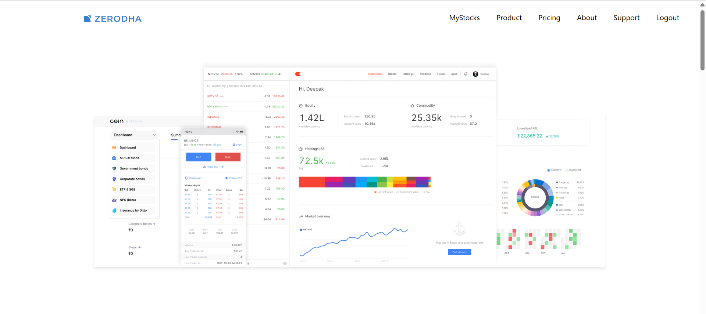
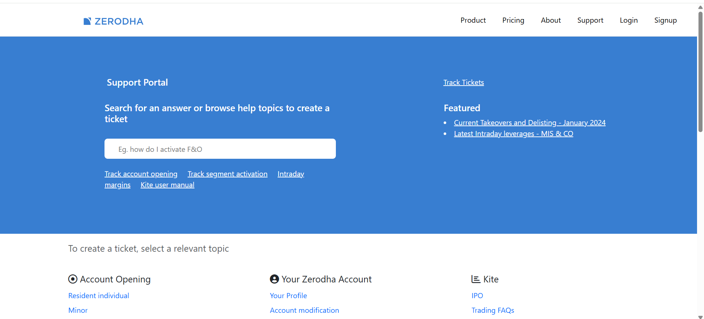
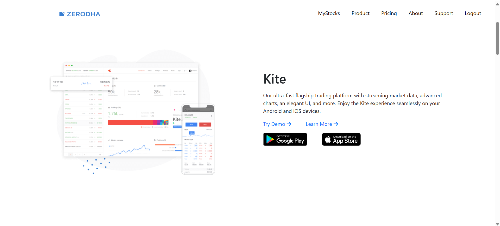
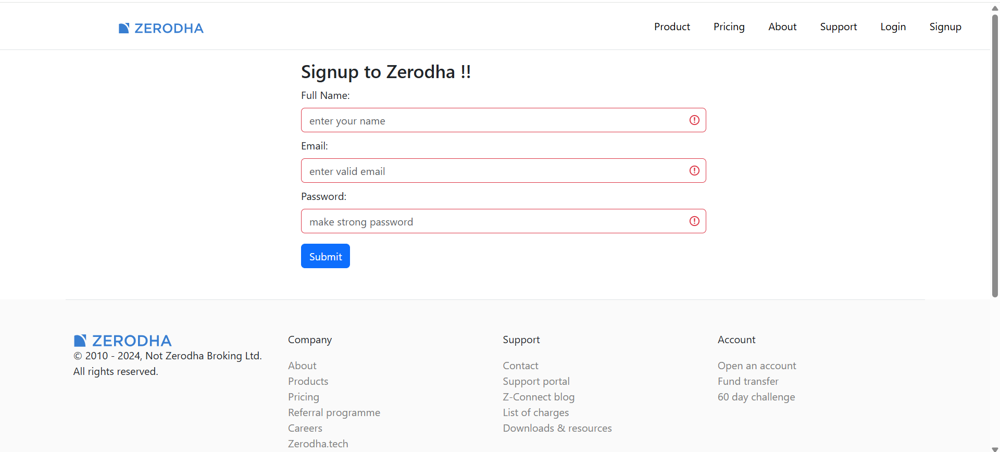
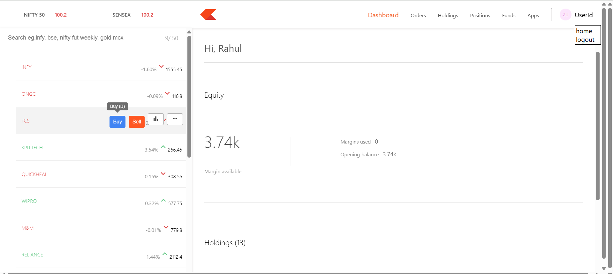
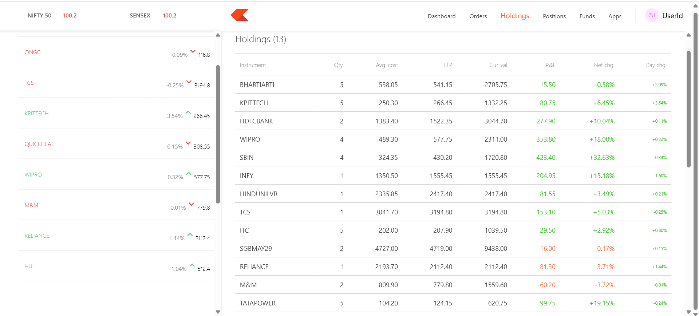
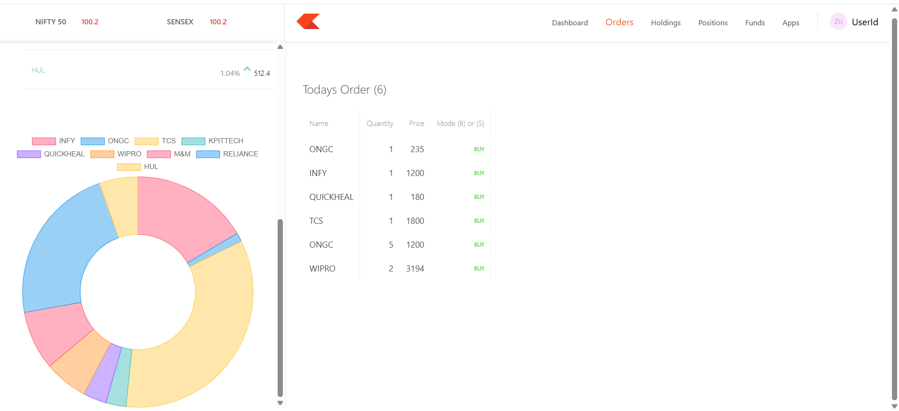

# Zerodha Clone

A full-stack Zerodha-inspired stock trading platform clone, built with **ReactJS + Vite** on the frontend and **Express.js** on the backend. It supports user **authentication (login/signup)** and includes several key features such as a dashboard, homepage, product page, holdings, and orders.

## Set Instructions

Before running the project, make sure you have the following installed:

- **Node.js** (v16 or higher)
- **npm** or **yarn**
- **MongoDB** (running locally or using a cloud service like MongoDB Atlas)

You will also need to create a `.env` file for the backend with your own secrets.

## 🖼️ Screenshots of projects

### Home Page  

### Support Page  

### Product Page  

### Signup Page  

### Dashboard Page

### Holdings Page  

### Orders Page  

For more Screenshorts please visit ScreenShorts folder of the project

## Tech Stack

### Frontend 
- **ReactJS** (with Vite)
- **React Router** for navigation
- **Axios** for API calls
- **CSS** used CSS Modules (for styling)

### Backend 
- **Node.js** + **Express**
- **JWT** for authentication
- **bcrypt** for password hashing
- **MongoDB** (via Mongoose)

## ✨ Some Key Features are ----

### Public Pages
- **Homepage** – Landing page introducing the platform
- **Product Page** – Highlights features and services
- **Support Page** - Helpfull for getting the support
- **About Page** - To know more about the developer

### Auth System
- **Sign Up** – Create account with email & password
- **Login** – Secure login with JWT stored in HTTP-only cookies
- **Logout** – Clear session securely

### Authenticated User Pages
- **Dashboard** – Overview after login
- **Holdings** – View your current stock holdings
- **Orders** – View and manage order history
- **Positions** - Contains the overall idea of your stocks

